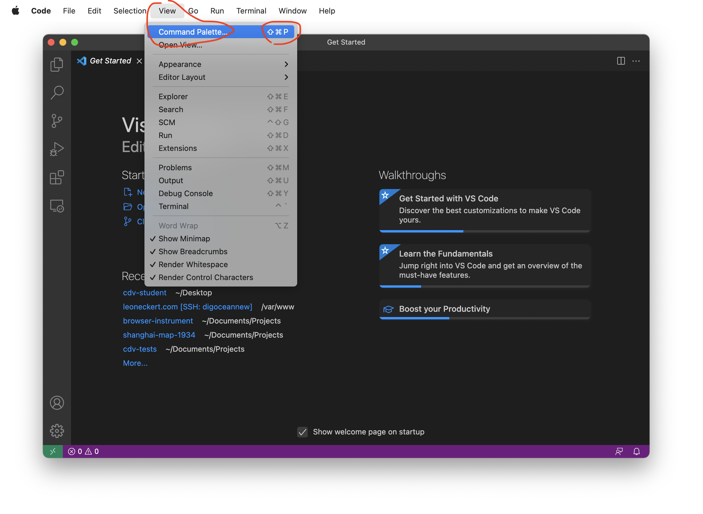

# Coding Exercise 1 (Foundation)

special note: many screenshots speak of "CDV" instead of "ABC". Please ignore. It will be fixed soon and is due to a recent decision to use a different text editor this semester. If it causes confusion, contact me. 

If things are unclear, please contact me on Slack or e-mail me at [leon.eckert@nyu.edu](mailto:leon.eckert@nyu.edu).

Setup

- [Github]()
    - Make a GitHub account
    - Create your own repository for this semester ("fork" one I prepared for you)
    - [Bring a website live on the web]() (using "Github Pages")
- [Software]()
    - Google Chrome
    - VS Code
- [Working Environment]()
    - Clone your remote repository using VS Code
    - Working on Projects
        - Open you files in VS Code
        - [Using Live Server]()
        - [Push changes to your remote GitHub repository]()
- [Coding Exercise]()
    - exercise
    - [submit your work]()

# **Setup**
 

## GitHub

This semester you will be maintaining your own Github **repository** to backup and share your work. You will have one folder in which all the work regarding this class will take place. Your **repository** ("repo") then can be thought of as an online backup copy of that local ("on your computer") project folder. The idea is this:


Above you see:

1. The **ABC Website** where almost everything you need to know is shared (schedule, assignments, ...)
2. The **ABC class repository**. I will share code there that we work on in class. And you will submit links to your own assignment work through this repository. More on that later!
3. **Your own repository**. You will be the only person uploading files to it, all the work your produce in this class. Instead of "uploading", we will call this action "push" from now on. You make changes to your files on your computer ("local"), then push them to your "remote repository". You see, I am sliding in some terminology here that you will need to get used to.

You will need to organize your files with a lot of care this semester, but it will pay off in exciting new learnings 👻

In the following steps, I will guide you through the setup of all this

### 1) Make a GitHub account.

This is much like setting up any other account, you will not need much help, except, let me recommend to make a student account instead of a regular one. It comes with some nice, free benefits: [https://education.github.com/pack](https://education.github.com/pack).

### 2) **Create your own repository.**

You can create as many repositories as you like. They are public by default, everyone can see them. It's great to share code, we should all get used to this. However, you should keep this in mind so you don't accidentally share sensitive information. Don't worry though, I will remind you often and show you ways to avoid it :)

You will find a big PLUS symbol (don't click it just yet 🚨 ) on the top right when you are logged into GitHub. This is where you create new repositories. Hold on though, don't click it 🤣  because you will create the repository for this class differently. Why? Because I have prepared some files for you.

You will "fork" (make a copy) of a repository I have prepared. Open this link in a new tab: [https://github.com/leoneckert/abc-student](https://github.com/leoneckert/abc-student). Click on "fork" in the top right corner:


After some seconds you will be redirected to a page that looks almost the same, but, if you look closely, you will notice that you now have your own copy of the repository that I prepared for you. You can also find it under your repositories on your profile:


### 3) Turn your repository into a "GitHub Page"

Now it will get exciting already. Websites are **code files** that are **on the web (on a server)** and can be requested/visited through the browser. GitHub is an **online** repository for your **code files**. On GitHub, we can visit and see the code you wrote ~~~~> but if these files are already online (on GitHub), we should be able to visit them and see them rendered as a real website, too. For this, GitHub created GitHub Pages - you can find instructions and information about it [here](https://pages.github.com/), but I'll also run you through the setup (spoiler: it's just a few clicks!).

Start by finding the settings of your repo. With the repo open, click right here:


In Settings, find “Pages” in the left sidebar. Select the "main" branch (if you are curious what a branch is, ask me after class 🙂 ), then click "Save":


The page should refresh, and should find your link in the same place:


Copy that link and make note of it somewhere. Also, open it in a new tab for now.

I want to pause here for a second and explain what is happening. Your repo is an online space where you will upload, backup, share your files, mainly coding files, and in our case, specifically web-coding files (written to be rendered as webpages). All those files can be accessed through the normal GitHub interface where we see the actual code -- try to click through your repo, there is some html code in the `projects/placeholder/website` folder:


The same files can also be accessed directly (not inside the GitHub interface); when doing this, the browser will try to render them as websites if it's possible (e.g. html files will always be rendered). That's wat GitHub Pages is for. The link you opened in the other tab, is looking at your repo and tries to render the files...

...check it out! Hopefully you will see a page displaying the repository's main `README.md` file: "ABC Browser Circus 🎪 ..." (most browsers render `.md` "markdown" in much the same way as html files).

Quiz: How could you make the browser render the `index.html` file that is inside the `projects/placeholder/website/` folder? Try to find a solution yourself before you scroll on.


The link to your GitHub Page (the one you copied before) that looks something like `your-username.github.io/abc-stud...` points to the "root" of your repo the most basic folder inside it. From there, you can navigate through all files and folders by modifying the url. If you append `/projects/placeholder/website/index.html` to the url, the browser will render that file/webpage. Try it! FYI, you can omit writing "index.html" here, as your browser looks by files with this name by default. Things should look like this:


Great. We are done with GitHub for now. Later we learn how we can modify files on our computer and then push them to the GitHub repository and hence truly do with the page(s) "what we want". 👻

## **Software**

Software you need for this class.

### **Google Chrome**

This is the browser we will be using. Please [download it](https://www.google.com/chrome/) if you don't have it already. I'd also recommend to make it your computer's default browser.

### **Text Editor**

I have used *Atom* in my classes in the past. **If you have a Text Editor you feel comfortable with, feel free to use it.** The only thing I require is that you (1) have a way to work with a local server and (2) know how to push changes you make to your files to your GitHub repository. I will be using the **Visual Code Studio (”VS Code”)** Text Editor this semester and invite you to do the same. You can download it [here](https://code.visualstudio.com/Download).

## VS Code Extensions

Using our Code Editor, we want to do three things: 

1. Create files, organize files and **write code**. (that is the application’s basic function)
2. Create a “**Live Server**” allowing us to view the website we are building, as we are making changes to it in the browser. (Install the “Live Server” extension, explained below)
3. Push/Upload changes our work to our remote repository on **GitHub**. (we will try to use the in-built “Source Control” function for this. You might see it already in the left sidebar, it looks like  a branch or a street intersection)

In the side bar select the Extension icon (four blocks) and search for the “Live Code” extension. Click “Install”. Done ✅ (more about it soon).


FYI: By default, VS Code appears in a dark color theme. You can modify themes in the preferences (click the gear ⚙️ in the bottom left and select “Color Theme”).

### **Working Environment**

For the whole semester, you will always work in the same folder (with subfolders of course). This folder exists already, but only online, in your GitHub repository (the one you forked before). Now we will download it, or as we call it in the context of GitHub, we **clone** your repository to you local machine (aka your computer).

**Clone remote repository using Atom**

> Folllwing the steps below you MAY run into issues because "git is not installed". For Mac users, the solution is most likely going to be installing the XCode Command Line tools (open the 'Terminal', enter `xcode-select --install`, hit enter and follow the instructions). For Windows users, you can follow VSCode's guidance. If VSCode doesn't guide, follow instructions on [this page](https://git-scm.com/download/win).


You only need to do this once in the first week. Dealing with GitHub and git these are two different things that walk hand in hand) can be complicated. If you run into any issues, or my guidance below simply does not work for you, do not hesitate message me on Slack or e-mail ([leon.eckert@nyu.edu](mailto:leon.eckert@nyu.edu)) me right away.

First, let's find the repository we want to clone on your GitHub profile - this should be the "abc-student" repo that is **on YOUR account** (the one you forked just a few minutes ago). In order to tell VS Code to **clone** it, we need to tell it where to find it. The descriptor we need is to be found on the right side in the repo's interface on GitHub, copy the HTTPS-link:


Next, in your VS Code, open the “Command Palette” via the menu bar or suing the shortcut:



The Command Palette is the place to interact with many of the advanced functionalities of VS Code (or its extensions). Luckily, it works much like a search bar. Search for “git clone” and hit enter.


VS Code now expects us to tell it where exactly to find the repository we want to clone (copy from a remote place (on GitHub, online) to our computer (”local”). Paste the link you copied from your GitHub repository earlier and hit enter again. 


<aside>
💡  I am anticipating complications 🚨 either here or a later step. In my preparation I could not re-create the situation you are in (first time VS Code user) in order to perfect this guide. 
I am thinking that either now, or in a later step, VS Code will ask you to authenticate your GitHub account. If this is the case, please let me know on Slack so I can (1) help you and (2) include the solution into this guide. Thank you!

</aside>

You will be asked which location you want to clone the repository to. Select your Desktop for now. 


In your file system, check the location you specified, the cloned repo should appear:


Close VS Code for now, and decide where you want to drag this folder to, put it somewhere where it can stay all semester (or maybe you are happy with it on the Desktop - I like my Desktop clean :)

Great, we are very far, everything you will work on takes place in this folder. Follow along as I run you through the basic workflow:

### **Working on Projects**

**Open your files in VS Code (the right way(s))**

Reopen VS Code, it should be empty. If it's not, close the tabs you see. Opening files in VS Code is easy, but it can often lead to confusions in your file structure if you don't follow the right steps. In my experience, opening single files in VS Code is never a good idea; instead I recommend **opening whole project folders** where we can see files and their context. In our case, let's always open the whole repo (the “abc-student” folder). There are three ways I use to do so, pick one:

1. In the menu bar, select `File>Open Folder`.
2. Find the folder in your file system and drag the whole folder onto the VS Code Icon in your dock.
3. If nothing else is open in VS Code (as it should) and you are in the Explorer area (first icon in left sidebar), click the “Open Folder” button:


This is how it should look for you:


**Using Live Server**

From now on you will always use the Live Server extension we installed before. Activate it by clicking “Go Live” in the bottom right corner of VS Code. 


Your default browser (make it be Chrome, please) should automatically open, in the url you will see something like `http://127.0.0.1:5500/` or `http://localhost:5500/` (the number at the end might vary) and in the browser you see all the folders and files from your "abc-student" directory:


great! this is exciting :D you will be able to see everything you work on here. Mainly you will work on websites in this class, if you work on them while using “Live Server”, you can see changes you make in real time. In your browser click on projects and the placeholder folder, the same website we saw on our GitHub Pages before!

Let's quickly hold here to reflect one what we already learned today: We build websites. Website are text-based code and the browser know how to interpret and render this text. **Locally** (on our computer) we can **see and edit the text/code in VS Code** while seeing the **rendered page in the browser using Live Server**. Equally, **online** ("remote") we can **see the text/code within the GitHub** interface and the **rendered version of the page on the GitHub Page** link we created earlier.

|         where         | see code |            see page            |
|:----------------------|:---------|:-------------------------------|
| local (your computer) |   Atom   | Browser (via atom-live-server) |
|  remote (on the web)  |  GitHub  | Browser (via GitHub Page link) |

If you make changes (in VS Code) to your file (the `index.html` in the placeholder page for example), you will see them immediately reflected in the browser. This is not “online”; it’s in the browser but only visible locally to you. That's how you work on your projects. When the work is done, you push the changes you made from you local repository (the whole class folder) to you remote one on GitHub....and then the online version, both GitHub and GitHub Page, will reflect your changes, too. That's what we will learn next.

Right after quickly...

**Shutting Down Live Server**

to shut down Live Server, simply click onto the “Port...” text you see in the same place you saw “Go Live” earlier:


### **Pushing changes to your remote GitHub repository**

Okay, I bet this is new for you and I am excited. Let's assume we work on a project somewhere inside the "abc-student" directory. Normally this would probably take place in a place like `abc-student/projects/fantastic-project`; but for now, let's make some changes in `projects/placeholder/website/index.html` and save them (cmd+s).

I edited index.html. As you see, VS Code colored the file (and the folder) in which changes occurred in the side bar. Also, you can see a counter appearing at the branch symbol in the other side bar on the very left.


This signals to us that the files have changed and not yet been backed up and pushed to GitHub.

(I want to mention here that apart from GitHub (online) there is something called "git" that exists locally. I will distinguish the two in more detail in class)

Next, we want to push these changes. Click onto the branch symbol in the left side bar. 

You will see the files that have been changed since the previous push (1). To “commit” these changes, first enter a short description of the changes you made (2), then hit the “Commit” symbol (3).  


<aside>
💡 You might run into an error message here, looking like this:


- Here are the steps to take if that is the case
    
    It means that git & GitHub need to know who you are – you don’t have a name tag yet basically.
    In the error message, we are told what the problem is “Please tell me who you are” and are given two commands to solve the issue (see below screenshot). Before we use the commands, make sure to know the email and username you are using on GitHub, using the same information here will avoid problems later on. 
    
    
    
    copy the first of the two commands
    
    ```
    git config --global user.email ""
    ```
    
    and click on the “Terminal” tab (next to “Output”). Then, paste the command and fill the e-mail you are using on GitHub between the quotes, then hit enter:
    
    
    
    after hitting enter there is not further feedback, but be assured that’s how it is done 🙂 next, do the same for your username:
    
    ```
    git config --global user.name ""
    ```
    
    do the same thing in the Terminal tab. And done. 
    
    You can now try to hit the “Commit” symbol (3) from the earlier step again. This time things should go smoothly.  
    
    
    
</aside>


Now the changes you made are **committed**, let’s think of this step as “making them official”, but they are not yet **pushed** on GitHub. To do that, click the “Sync Changes” button and confirm. 

<aside>
💡  If the complication 🚨 I anticipated earlier hasn’t occurred yet, I believe now would be the time. Are you asked to authenticate your Github account in a strange sounding way?
Please contact me if things look confusing here in any way (they will!) so I can (1) help you and (2) include the solution into this guide. Thank you!

</aside>


[...let’s figure this step out together...]

Done! In the “Changes” section of the branch area, there shouldn’t be any changes visible anymore because you have **committed** and **pushed** them to GitHub!

🎉

Quick, check your online GitHub interface and see if the changes show up there, too. Then check your rendered GitHub Page and see if the changes render accordingly online. 

**How often to push changes?**

You save your changes ALL THE TIME because that way you see them in your browser via Live Server. However, you only commit and push changed “every now and then”, not so often. Certainly when you want to show your work online (e.g. to submit homework) and perhaps after adding considerable work to your project as a way to save a milestone, e.g. after adding a specific feature to a visualization that was very hard to figure out. 

Well, that's it, you made it. You can now use GitHub (and VS Code and Live Server). This is very cool!!!

## **Coding Exercise**

**Chrome Developer Tools**

The Chrome Browser gives us tool that are **indispensable** when developing websites. If you understand just two features (the "Elements" tab and the "JavaScript Console") and make use of them while coding, you will build great websites very quick. Please make yourself familiar by reading the [Introduction](https://www.bitdegree.org/learn/chrome-developer-tools) as well as the chapters about [Elements](https://www.bitdegree.org/learn/inspect-element) and the [JavaScript Console](https://www.bitdegree.org/learn/javascript-console).

### **File Structure**

It will make your life easier if you organize your files well. Here is the structure I recommend for you `abc-student` directory:

```
abc-student
├── projects
│   ├── placeholder
│   │   ├── website
│   │   │   ├── index.html
│   │   │   └── style.css
│   │   └── README.md
│   ├── README.md
│   └── ...
│
├── mini-projects
│   ├── placeholder
│   ├── coding-foundation  <-- create this folder for the following exercise
│   │   ├── index.html
│   │   ├── style.css
│   │   ├── script.js
│   │   └── ...
│   ├── README.md
│   └── ...
├── README.md
└── ...
```

Please start to bring such a structure into place. You can create folders and files within Atom's sidebar.

### **Build a website**

Finally, making use of the **Live Server** and **Chrome Developer Tools** you learnt above, **build a website** in `abc-student/coding-exercises/coding-foundation`. There are much fewer instructions than above because I want you to figure out (recall from last Semester / the internet) much on your own. Your website should have **separate html, css, js files** and behave like this one (but does not need to look exactly the same, be creative!):


Please build a website like this in pure ("vanilla") JavaScript (no libraries! no p5! no jquery!). Feel free to add you own styling or variations. But keep the functionality: an input element that controls the number of elements (in my case white boxes) on the page. Give your best and ask the Internet all of your questions, it can help!

### **keyword hints**

`getElementById`, `createElement`, `appendChild`, `flexbox`, `for-loop`, `addEventListener`, `function`

### **"it doesn't work!" trick**

if things don't behave the way you want/expect them to, please check if there are error messages in the Chrome JavaScript Console (learnt above) - the console should be open by default while you are working. The error message in itself might give you a hint, and if it doesn't, copy-paste the whole error message into Google - someone else likely encountered similar difficulties and found solutions.

### **great trick**

if you use VC Code to create new files and give them the right extension (".html", “.js”,...)...


...then VS Code will give you very useful auto-complete benefits saving you a ton of work:


### **comment your code, please**

In all coding you do this semester, please make sure to use comments in your code explaining what you are doing. Using VS Code, you can normally highlight whatever you want to "comment out" and hit `cmd+/`.

### **After you are done**

### **Add a README.md file**

Your work will look great on GitHub if you add README.md files to folders. GitHub renders them as the "front page" of a folder - just like [here](https://github.com/leoneckert/critical-data-and-visualization-spring-2022), for example. The ".md" stands for "Markdown" which is a specific syntax for writing text. Since this might be your first time doing this, simply add the README.md file here:

```
abc-student
├── coding-exercises
│   ├── ...
│   │
│   ├── coding-foundation  
│   │   ├── ...
│   │   └── README.md <-- add this file.
│   └── ...
└── ...
```

...and write something into it. If you had difficulties with the assignment, please describe them there. If you want the README.md file look great on GitHub, please see this [Markdown Cheatsheet](https://guides.github.com/features/mastering-markdown/)) as well as the Markdown preview option in VS Code:


### **Push it all to your GitHub**

[As learnt above]()

### **Add a link to our class Wiki**

find the files you have just worked on on your GitHub account (do you see the README.md file rendered, too?). You should submit two links: The link to your actual code (in GitHub, looks something like "github.com/your-username/abc-student/tree/main....") as well as the link to your rendered page (GitHub Pages that you set up before, the link looks something like "your-username.github.io/abc-student/coding-exercises....")

Copy the links and paste them to our [Class Wiki](https://github.com/leoneckert/abc-browser-circus/wiki).

## **DONE! 😃**

### **This was A LOT. Please be proud.**

<!-- ### **goats**

This exercise is **absolutely optional** (unless otherwise noted ;-):

 -->