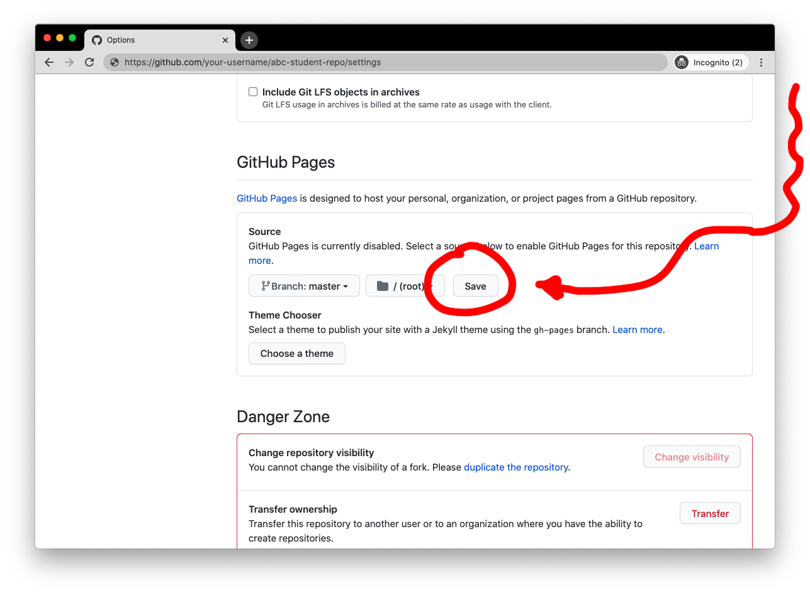

# Coding Foundation
## Setup and Coding Exercise

If things are unclear, please e-mail me at leon.eckert@nyu.edu.

- Setup
  - [Github](#github)
    - Make a GitHub account
    - Create your own repository for this semester ("fork" one I prepared for you)
    - [Bring a website live on the web](#3-turn-your-repository-into-a-github-page) (using "Github Pages")
  - [Software](#software)
    - Google Chrome
    - Atom Text Editor
    - Atom Packages
  - [Working Environment](#working-environment)
    - Clone your remote repository using Atom
    - Working on Projects
      - Open you files in Atom
      - Use atom-live-server
      - [Push changes to your remote GitHub repository](#the-push)
- [Coding Exercise](#coding-exercise)
  - [exercise](#chrome-developer-tools)
  - [submit your work](#after-you-are-done)


### Setup
#### GitHub

This semester you will be maintaining your own Github **repository** to backup and share your work. You'll have one folder in which all the work regarding this class will take place. Your **repository** ("repo") then can be thought of as an online backup copy of that local ("on your computer") project folder. The idea is this:


As you can see above, you will be interacting with **two** repositories this semester:

- The one on the left is the one I am maintaining (it's [this one](https://github.com/leoneckert/abc-browser-circus)). It will mainly be used for sharing code and learnings with you. Let's say you will **get** information here.
- The other one, on the right, is your own, on your account (we will sign up further below). You will be the only person uploading files to it, all the work your produce in this class. Instead of "uploading", we will call this action "push" from now on. You make changes to your files on your computer ("local"), then push them to your "remote repository". You see, I am sliding in some terminology here that you will need to get used to.

You will need to organize your files with a lot of care this semester, but it will pay off in exciting new learnings 👻.

In the following steps, I will guide you through the setup of all this.

##### 1) Make a GitHub account.

This is much like setting up any other account, you will not need much help, except, let me recommend to make a student account instead of a regular one. It comes with some nice, free benefits: https://education.github.com/pack.

##### 2) Create your own repository.

You can create as many repositories as you like. They are public by default, everyone can see them. It's great to share code, we should all get used to this. However, you should keep this in mind so you don't accidentally share sensitive information. Don't worry though, I will remind you often and show you ways to avoid it :)

You will find a big PLUS symbol (don't click it just yet 🚨) on the top right when you are logged into GitHub. This is where you create new repositories. Hold on though, don't click it 🤣 because you will create the repository for this class differently. Why? Because I have prepared some files for you.

You will "fork" (make a copy) of a repository I have prepared. Open this link in a new tab: https://github.com/leoneckert/abc-student-repo/. Click on "fork" in the top right corner:


After some seconds you will be redirected to a page that looks almost the same, but, if you look closely, you will notice that you now have your own copy of the repository that I prepared for you. You can also find it under your repositories on your profile:


##### 3) Turn your repository into a "GitHub Page"

Now it will get exciting already. GitHub is a online repository for your (code) files. You write code to build websites. 1+1=2. If these files are already online (on GitHub), we should be able to visit them and see them rendered as a real website, too. For this, GitHub created GitHub Pages - you can find instructions and information about it [here](https://pages.github.com/), but I'll also run you through the setup (spoiler: it's just a few clicks!)

Start by finding the settings of your repo. With the repo open, click right here:


Next, scroll to find the GitHub Pages section and select the "master" branch (if you are curious what a branch is, ask me after class 🙂), like so:


Hit "Save":



The page should refresh, scroll done again, and find your link:


Copy that link and make note of it somewhere. Also, open it in a new tab for now.

I want to pause here for a second and explain what is happening. Your repo is an online space where you will upload, backup, share your files, mainly coding files, and in our case, specifically web-coding files (written to be rendered as webpages). All those files can be accessed through the normal GitHub interface where we see the actual code -- try to click through your repo, there is some html code in the `projects/test-page/index.html` folder:


The same files can also be accessed directly (not inside the GitHub interface); when doing this, the browser will try to render them as websites if it's possible (e.g. html files will always be rendered). That's wat GitHub Pages is for. The link you opened in the other tab, is looking at your repo and tries to render the files...

...check it out! You might either see a page that signals "No website found" or something similar, or a page displaying the repository's main ``README.md`` file: "ABC Browser Circus 🎪..." (some browsers render `.md` "markdown" in much the same way as html files).

Quiz: How could you make the browser render the `index.html` file that is inside the `projects/test-page/` folders? Try to find a solution yourself before you scroll on.


The link to your GitHub Page (the one you compied before) that looks soething like `your-username.github.io/abc-stud...` point to the "root" of your repo the most basic folder inside it. From there, you can navigate through all files and folders by modifying the url. If you append `/projects/test-page/index.html` to the url, the browser will render that files. Try it! FYI, you can ommit writing "index.html" here, as your browser looks by files with this name by default. Things should look like this:


Great. We are done with GitHub for now. Later we leanr how we can modify files on our computer and then push them to the GitHub repository and hence truly do with the page(s) "what we want". 👻

#### Software

Software you need for this class.

##### Google Chrome
This is the browser we will be using. Please [download it](https://www.google.com/chrome/) if you don't have it already. I'd also recommend to make it your computer's default browser.

##### Atom Text Editor
We will be using Atom to write our code. Please download it [here](https://atom.io/).

##### Atom Packages

We are going to use four Atom extensions. Three of them come pre-installed. Verify if you see them when you open Atom:


Apart from these, there is one more we need. It's called **atom-live-server** (`atom-live-server-plus` also works). To install it go to `Atom>Preferences...`, click on `+ Install`, find **atom-live-server** and hit `install`:


Verify that it is installed (for you, it might appear at a different location in this drop-down menu):


Great! We have achieved a lot already.

You see that in my screenshots, Atom appears in a light color theme while yours might be dark. You can modify or try out user-created themes in the preferences (under `Themes`, but also under `Install>Themes`). In the future, you could also try to design your own theme if you want to 🎨.


#### Working Environment

For the whole semester, you will always work in the same folder (with subfolder of course). This folder exists already, but only online, in your GitHub repository. Now we will download it, or as we call it in the context of GitHub, we **clone** your repository to you local machine (aka your computer).

##### Clone remote repository using Atom
You only need to do this once in the first week. Deadling with GitHub and git these are two different things that walk hand in hand, info) can be complicated. If you run into any issues, or my guidance below simply does not work for you, do not hesitate to e-mail (leon.eckert@nyu.edu) me right away.

First, let's find the repository we want to clone on your GitHub profile - this should be the "abc-student-repo" that is on YOUR account (the one you forked just a few minutes ago). In order to tell Atom to clone it, we need to tell it where to find it. The descriptor we need is to be found on the right side in the repo's interface on GitHub, copy the HTTPS-link:


Next, in your Atom, you should see "git" and "GitHub" in the bottom right corner. If not, click them in the `Packages` drop down menu instead. In the GitHub tab you should find a button saying "Clone and existing GitHub repository":


🚨If the clone button does not show up in your version of Atom, take these two steps instead:


Here is where we can tell Atom (and something called 'git') where exactly to find the repo that already exists in our GitHub account. Now you can paste the HTTPS link you copied a few steps ago as well as designate where the repo should be downloaded to -- I suggest the Desktop (you can then move it elsewhere afterwards).


Hit `Clone` and check your Desktop:


Close Atom for now, and decide where you want to drag this folder to, put it somewhere where it can stay all semester (or maybe you are happy with it on the Desktop - I like my Desktop clean :)

Great, we are very far, everything you will work on takes place in this folder. Follow along as I run you through the basic workflow:

##### Working on Projects
###### Open your files in atom (the right way(s))

Reopen Atom, it should be empty. If it's not, close the tabs you see. Opening files in Atom is easy, but it can often lead to confusions in your file structure if you don't follow the right steps. In my experience, opening single files in Atom is never a good idea; instead I recommed opening whole project folders where we can see files and their context. In our case, let's always open the whole repo.

I recommend to use one of two ways to open the repo in Atom:

- METHOD 1: After opening Atom, click `File>Open...` and navigate to your folder, don't click on a subfolder or a specific file, just on the folder named "abc-student-repo". Then click `Open`.
- METHOD 2: Find the "abc-student-repo" folder in your file system, drag it onto the Atom application icon (in Mac's dock, or windows' application tab)

If you did it correctly you will notice two things.
1. Atom displays all the files and subfolder easily accessible in the sidebar.
2. See this little book symbol next to the name of the repository? That means that Atom knows that it is also a GitHub repository and will make it really easy for us to push our changes to GitHub (because that's the idea if you remember the very first drawing of this tutorial)!


From now on you will always use atom-live-server. Let's see how it works. With your folder open in Atom, click `Packages>atom-live-server>Start Server`:


Your default browser (make it be Chrome, please) should automatically open, in the url you will see something like `http://127.0.0.1:3000/` or `http://localhost:3000/` (the number at the end might vary) and in the browser you see all the folders and files from your "abc-student-repo" directory:


great! this is exciting :D you will be able to see everything you work on here. Mainly you will work on websites in this class, if you work on them while using `atom-live-server` you can see changes you make in real time. In your browser click on projects and the test-page folder, the same website we saw on our GitHub Page before!

Let's quickly hold here to reflect one what we already learned today: We build websites. Website are text-based code and the browser know how to interpret and render this text. **Locally** (on our computer) we can **see and edit the text/code in Atom** while seeing the **rendered page in the browser using atom-live-server**. Equally, **online** ("remote") we can **see the text/code within the GitHub** interface and the **rendered version of the page on the GitHub Page** link we created earlier.

|         where         | see code |            see page            |
|:----------------------|:---------|:-------------------------------|
| local (your computer) |   Atom   | Browser (via atom-live-server) |
|  remote (on the web)  |  GitHub  | Browser (via GitHub Page link) |


If you make changes (in Atom) to your file (the `index.html` in the test-page folder for example), you will see them immediately reflected in the browser. That's how you work on your projects. When the work is done, you push the changes you made from you local repository (the whole class folder) to you remote one on GitHub....and then the online version, both GitHub and GitHub Page, will reflect your changes, too. That's what we will learn next.

Right after quickly...

###### Shutting down atom-live-server

The best way would be to click on `Packages>atom-live-server>Stop...`, but if you forget this sometimes and just close Atom, or leave the live server open, that's not a big deal either.

###### Pushing changes to your remote GitHub repository

Okay, I bet this is new for you and I am excited. Let's assume we work on a project somewhere inside the "abc-student-repo" directory. Normally this would probably take place in a place like `abc-student-repo/projects/fantastic-project`; but for now, let's make some changes in `projects/test-page/index.html` and save them (cmd+s).

I edited index.html (Atom colored it brown-yellow (gold?!) in the sidebar) and added an image (colored green).


No matter which exact colors (yours might be different depending on the theme), what this signals to us is that the files have changed and not yet been backed up and pushed to GitHub.

(I want to mention here that apart from GitHub (online) there is something called "git" that exists locally. I will distinguish the two in more detail in class)

Next, we want to push these changes. Find the little, tiny "Git" at the bottom right of the window? (If not, look out for "Git" under "Packages" in the menu bar).


##### The push

There is **three steps** you need to do every time you **push changes to GitHub**:

1. Stage changes (select which files/changes to commit and push)
2. Commit (add a little messages about the changes you made)
3. Push (push the changes to Github)

Stage changes:
- In most cases you can click "Stage all", which will simply stage all the files in which you made changes since your last push. FYI in the box dialogue you can always see those files.


Commit:
-  Note how you can now see the files you have staged in the second box. In the box that says "commit message", type a little message describing the changes you made, keep it simple, late at night even a "💤" will do. Best practice is to be specific. One benefit of using GitHub is that you can go backwards in time when your project suddenly doesn't work anymore. You can go back to any commit/push you want. For this, a descriptive commit message is helpful, too. When you are done, click the "Commit to master" button.


Push:
- The last step is to push it all up to GitHub. Click Push at the bottom. Then, check your GitHub repository online. Are the changes there? 🤞 And if yes, what about the GitHub page you created before? 🤞🤞🤞


Well, that's it, you made it. You can now use GitHub (and Atom and atom-live-server). This is very cool!!!

### Coding Exercise

##### Chrome Developer Tools

The Chrome Browser gives us tool that are **indispensable** when developing websites. If you understand just two features (the "Elements" tab and the "JavaScript Console") and make use of them while coding, you will build great websites very quick. Please make yourself familiar by reading the [Introduction](https://www.bitdegree.org/learn/chrome-developer-tools) as well as the chapters about [Elements](https://www.bitdegree.org/learn/inspect-element) and the [JavaScript Console](https://www.bitdegree.org/learn/javascript-console).

##### File Structure

It will make your life easier if you organize your files well. Here is the structure I recommend for you ``abc-student-repo`` directory:

```
abc-student-repo
├── projects
│   ├── test-page
│   │   ├── index.html
│   │   └── README.md
│   ├── coding-foundation
│   │   ├── index.html
│   │   ├── style.css
│   │   ├── script.js
│   │   ├── README.md
│   │   └── ...
│   ├── README.md
│   └── ...
├── README.md
└── ...
```

Please start to bring such a structure into place. You can create folders and files within Atom's sidebar.

#### Build a website

Finally, making use of the **atom-live-server** and **Chrome Developer Tools** you learnt above, **build a website** in ``abc-student-repo/projects/coding-foundation``. There are much fewer instructions than above because I want you to figure out (recall from last Semester / the internet) much on your own. Your website should have **separated html, css, js files** and behave like this one (but does not need to look exactly the same, be creative!):


*if you want another exercise, [goats](#goats)

Please build a website like this in pure ("vanilla") JavaScript. Feel free to add you own styling or variations. But keep the functionality: an input element (of type "range") that controls the number of images (in my case goats) on the page. Give your best and ask the Internet all of your questions, it can help!

###### keyword hints

``getElementById``, ``createElement``, ``appendChild``, ``flexbox``, ``for-loop``, ``addEventListener``, ``function``

###### "it doesn't work!" trick

if things don't behave the way you want/expect them to, please check if there are error messages in the Chrome JavaScript Console (learnt above) - the console should be open by default while you are working. The error message in itself might give you a hint, and if it doesn't, copy-paste the whole error message into Google - someone else likely encountered similar difficulties and found solutions.

###### great Atom trick

if you use Atom to create new files and give them the right extension (".html")...


...then Atom will give you very useful auto-complete benefits saving you a ton of work:


###### comment your code, please
In all coding you do this semester, please make sure to use comments in your code explaining what you are doing. Using atom, you can normally highlight whatever you want to "comment out" and hit ``cmd+/``.


##### After you are done

###### Add a README.md file

Your work will look great on GitHub if you add README.md files to folders. GitHub renders them as the "front page" of a folder - just like you are reading this text right now (it is written on a README.md file, too). The ".md" stands for "Markdown" which is a specific syntax for writing text. Since this might be your first time doing this, simply add the README.md file here:

```
abc-student-repo
├── projects
│   ├── coding-foundation
│   │   ├── ... <----- the website you just built
│   │   └── README.md  <-------- Add this file
│   │
│   ├── test-page   
│   └── ...
└── ...
```

...and write something into it. If you had difficulties with the assignment, please describe them there. If you want the README.md file look great on GitHub, please see this [Markdown Cheatsheet](https://guides.github.com/features/mastering-markdown/)) as well as the Markdown preview option in Atom (``Packages>Markdown Preview>Toggle Preview``).


###### Push it all to your GitHub

[As learnt above](#the-push)

###### Add a link to our class Wiki

find the files your have just worked on on your GitHub account (do you see the README.md file rendered, too?). Copy the link to them (this will probably look a bit like ``github.com/your-username/abc-student-repo/tree/master/projects/coding-foundation``) and paste it on our [Class Wiki](https://github.com/leoneckert/abc-f20/wiki).

## DONE! 😃
### This was A LOT. Please be proud.

***
***

###### goats

This exercise is **absolutely optional** (unless otherwise noted ;-):


