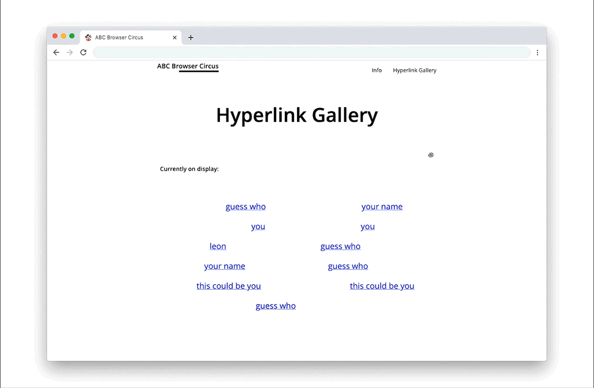

## Hyperlink Gallery

Work on this after you have completed the Coding Foundation Exercise.



ABC maintains its own gallery, the Hyperlink Gallery; this is its [lobby](https://abc.leoneckert.com/hyperlink-gallery). This week, you will move into one of the gallery's rooms and prepare it to share your work there throughout the semester.

#### How to move in?
First, you need to create a room on the web. You should do this within your repository. Your repository is already online using GitHub Pages, so all it takes to create a room (a webpage, I mean), is to create a new folder and populate it with a `index.html` file. I suggest this structure:

```
abc-student
├── projects
│   ├── placeholder
│   ├── README.md
│   └── ...
│
├── mini-projects
│   ├── placeholder
│   ├── coding-foundation 
│   ├── README.md
│   └── ...
│
├── your-name-room   <---- create this folder with a better name :)   
│   ├── index.html   <---- and this file   
│   └── ...          <---- and more   
│
└── ...
```


Once you push these changes to your remote GitHub repository, you can find the new page online, copy the link, and  use it to fill out this [spreadsheet](https://docs.google.com/spreadsheets/d/1u47A9A0Jm0g9n6sPnMBT8QeiHfpxYt4jNHGcXILFHlc/edit?usp=sharing), in the name column, put any name you want to appear on the [Hyperlink Gallery](https://abc.leoneckert.com/hyperlink-gallery) page.

#### What to put into my room?
It's your room! Your main task is to personalize it and make it your own; make it unique and represent you as a creative being.

##### Must-have content
You will work on 10 projects this semester. They don't exist yet, but we already know they will; in your room, create placeholders with empty links. As you produce the work this semester, you can fix those links one by one. Your need placeholders for:
- three larger projects (e.g. "Project A", "Project B", "Project C")
- seven smaller projects (e.g. "Mini Project #1", "Mini Project #2", ...)
- you don't have to name you placeholders literally "Mini Project 1" etc., it's your room, don't make it look like school :)
- Once you are done coding (or before you start, your choice), please include the following code-snippet at the very top of your page:
  ```
  <!-- Hyperlink Gallery Banner -->
  <div style="position:fixed;width:100%;top:0;left:0;z-index:5;background-color:white;font-family:sans-serif;border:5px solid black;display:flex;justify-content:space-between;align-items:center;padding:0 20px;box-sizing:border-box;font-weight:bold;"><p style="margin:4px 0;margin-right:10px;font-weight:normal"><a style="color:black;font-size:0.9em;" href="https://abc.leoneckert.com/hyperlink-gallery"><< Lobby</a></p><span>H</span><span>y</span><span>p</span><span>e</span><span>r</span><span>l</span><span>i</span><span>n</span><span>k</span><span> </span><span>G</span><span>a</span><span>l</span><span>l</span><span>e</span><span>r</span><span>y</span><p style="margin:4px 0;margin-left:10px;font-weight:normal"><a style="color:black;font-size:0.9em;" href="https://abc.leoneckert.com/random-artist">random >></a></p></div>
  ```
  I recommend to place it at the very top of your `<body>` tag, right here:
  ```
  <html>
    <head>
      [...]
    </head>
    <body>
      ... <-----ADD THE SNIPPET RIGHT HERE!

      [your html code is here]
    </body>
  </html>
  ```
  The snippet will add a slim, unobtrusive banner to your page from where a visitor can choose to go back to the Hyperlink Gallery starting page ("Lobby") or get to a random other room (one by your classmates). 👍 Let me know if this does not work for some reason :)

  If the banner **covers some of your own content**, you can apply a small padding to the `<body>`; for example by replace the opening body tag with `<body style="padding-top:30px">`

Aside this, you can include anything you want. Your name, of course, a bio? a statement? Something visual? Something audible? Keep in mind, in this room, you will share the work you produce in this course, not work you produce(d) outside. It is not a general portfolio, but one room inside the gallery. Design and curate this space that will present your future work in its best light.

##### Words of advice
Your room will change throughout the semester, you will learn new tricks and want to tweak, add, remove parts of your design of the room. That is fine, even expected. It is necessary (and relevant to grading) however that you think about your choices at this point already. The focus should be primarily on the visual design, then on the technical execution. The room itself must not be an artwork. It is a platform on which to present your art. Speaking of grading, your room will be evaluated once in Week 2, and once after the semester (as you may make changes and apply newly learned skills along the course).

##### An example

Here is [my room](https://leoneckert.github.io/abc-browser-circus/hyperlink-gallery/leon-room/)*, it's very boring. Visitors will turn around on the doorstep and head for your room instead :) Make them feel welcome, and enjoy their stay. My room uses HTML and CSS only, I encourage you to include some JavaScript in yours for a more interesting experience.

*note that the "3D" effect in my room is achieved by just a single image in the background. It's not real. Feel free to experiment with similar tricks and illusions :)

##### One more piece of advice (don't use heavy assets)

Students in the past have enjoyed using images or even videos in their Hyperlink Gallery Rooms. You may do that, of course, but make sure to resize the files as much as possible to avoid your room to be very slow and loading 🌀 for a long time.
