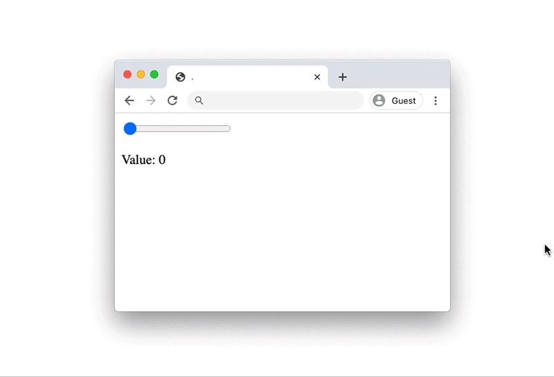
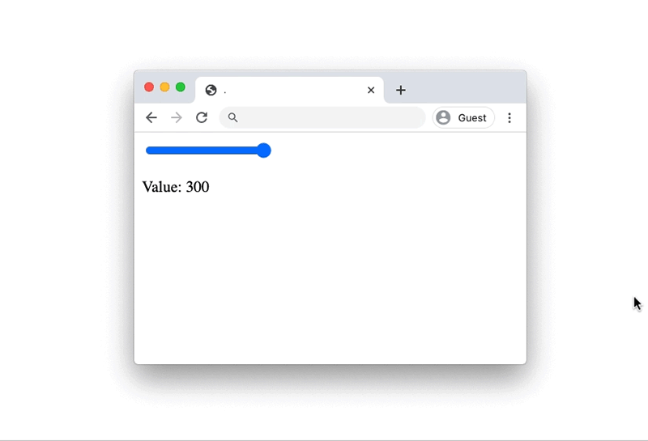
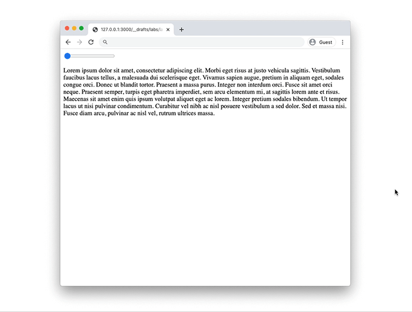

See above the code we wrote in class.
The rendered websites are here:
- [range-1](https://leoneckert.github.io/abc-f20/labs/lab-01/in-class-code/range-1/)
- [range-2](https://leoneckert.github.io/abc-f20/labs/lab-01/in-class-code/range-2/)
- [letter-rain](https://leoneckert.github.io/abc-f20/labs/lab-01/in-class-code/letter-rain/)

