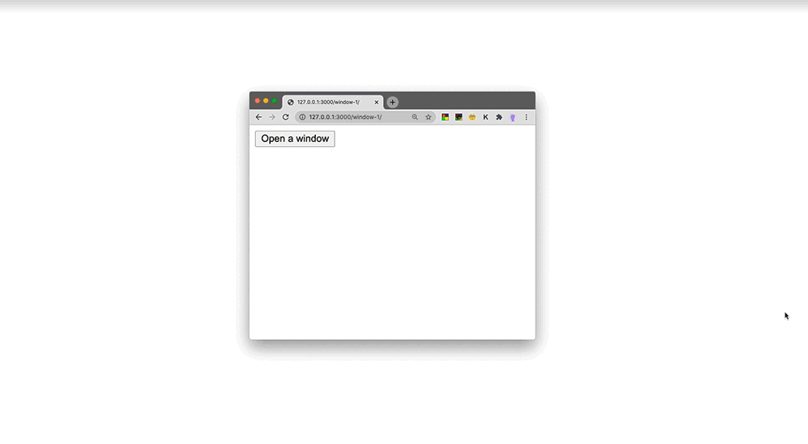
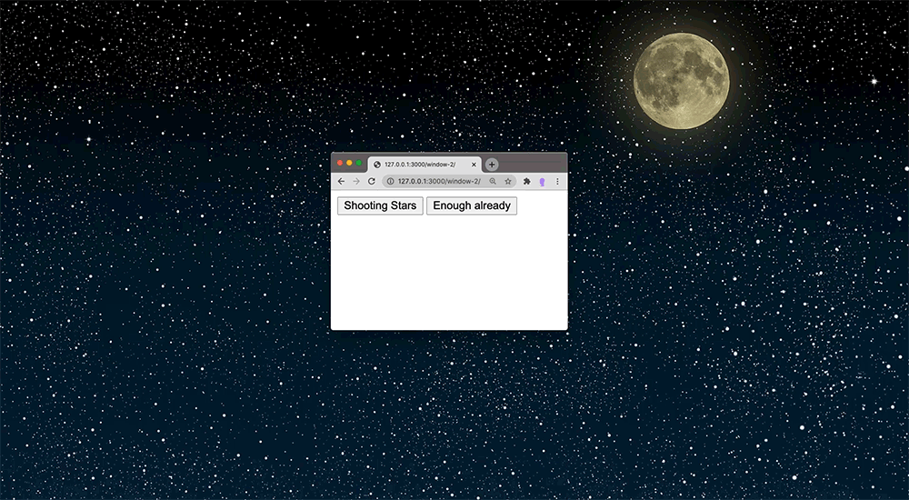

See above the code we wrote in class. And an additional "project" we didn't get to.
The rendered websites are here:
- [window-1](https://leoneckert.github.io/abc-f20/labs/lab-02/in-class-code/window-1/)
- [window-2](https://leoneckert.github.io/abc-f20/labs/lab-02/in-class-code/window-2/)

