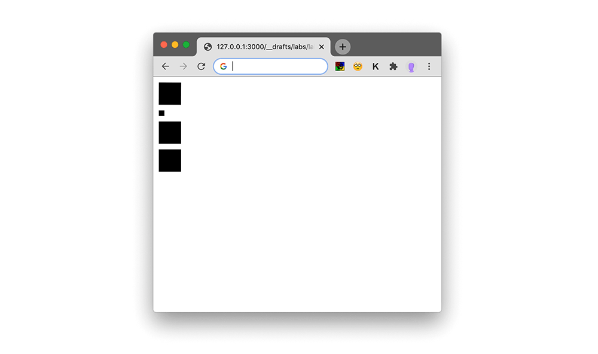
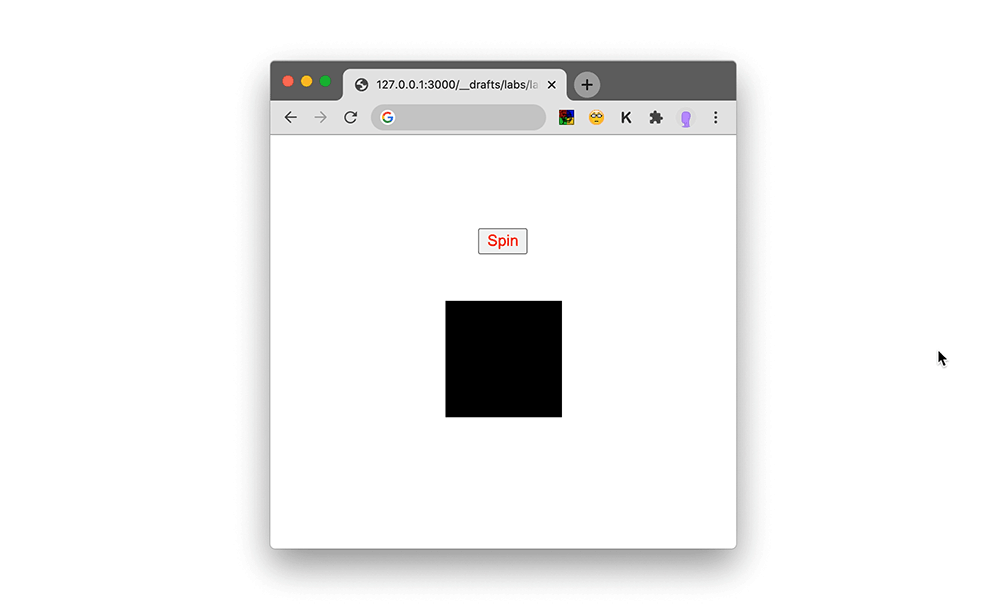
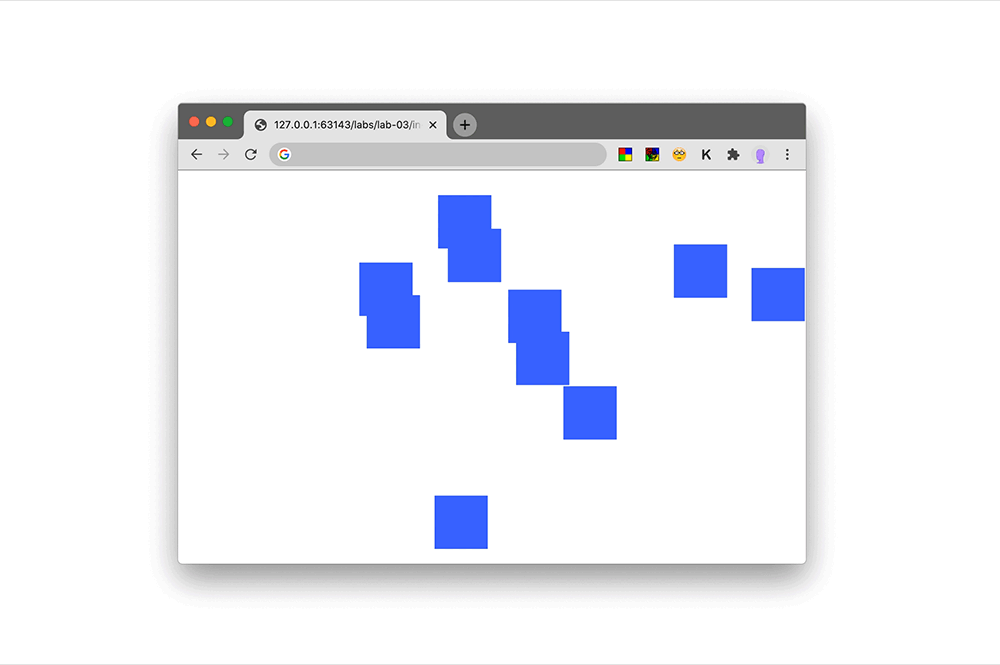
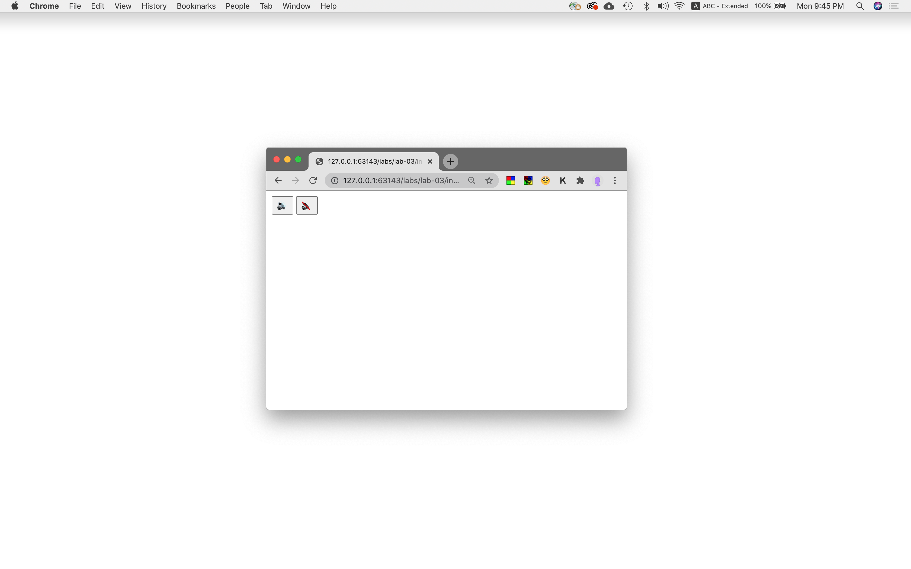
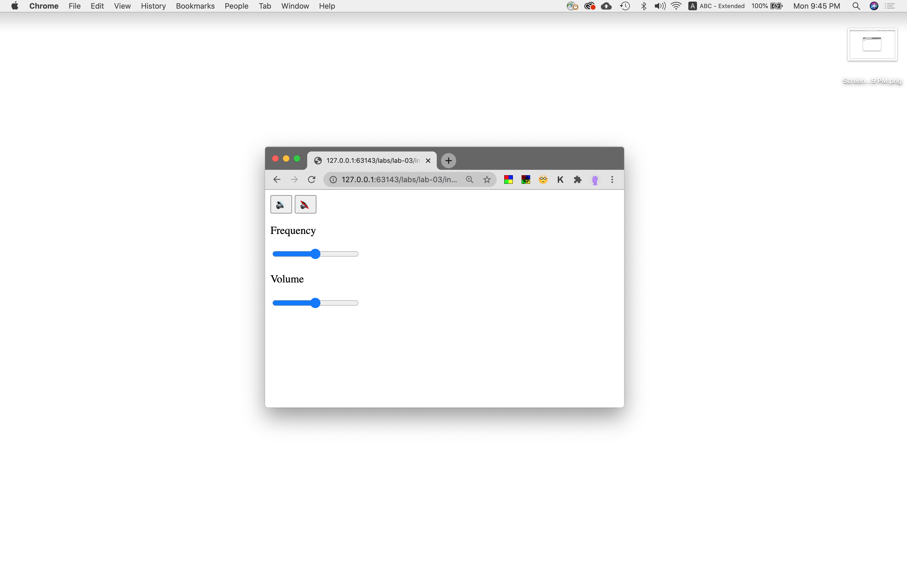
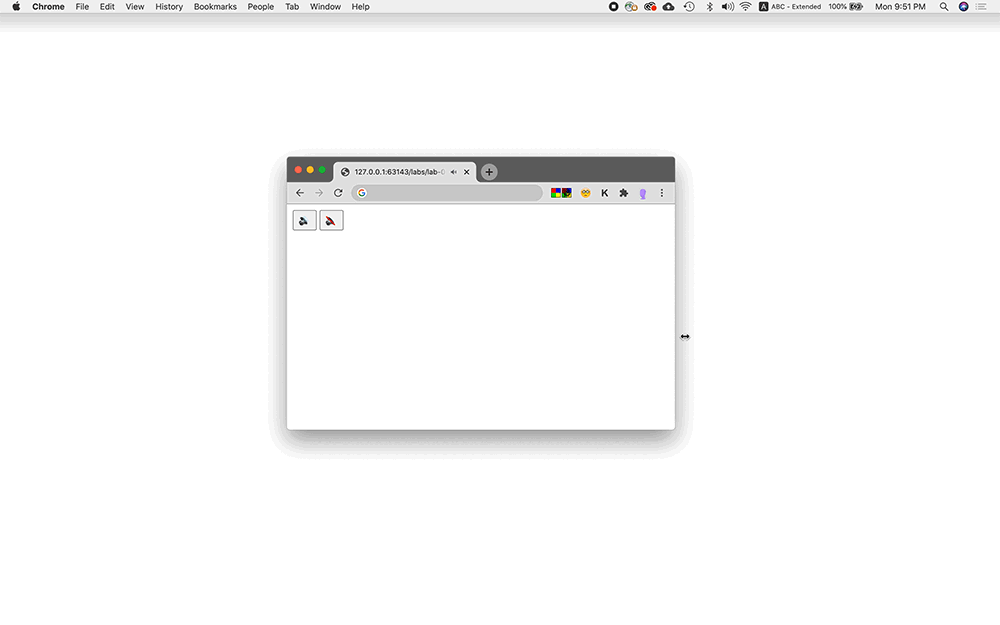

See above the code we wrote in class.

The rendered websites are here:
- [animation-0](https://leoneckert.github.io/abc-browser-circus/labs/lab-03/in-class-code/animation-0/index.html)
- [animation-1](https://leoneckert.github.io/abc-browser-circus/labs/lab-03/in-class-code/animation-1/)
- [animation-2](https://leoneckert.github.io/abc-browser-circus/labs/lab-03/in-class-code/animation-2/)
- [audio-0](https://leoneckert.github.io/abc-browser-circus/labs/lab-03/in-class-code/audio-0/)
- [audio-1](https://leoneckert.github.io/abc-browser-circus/labs/lab-03/in-class-code/audio-1/)
- [audio-2](https://leoneckert.github.io/abc-browser-circus/labs/lab-03/in-class-code/audio-2/)

