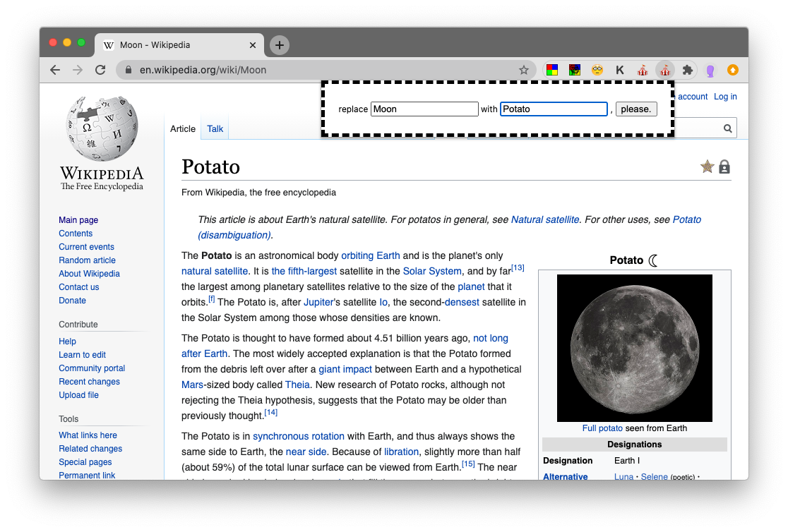

See above the code we wrote in class:

- replacer extension with comments
  - code above
  - [download link](https://github.com/leoneckert/abc-browser-circus/raw/main/labs/lab-04-extensions/in-class-code/replacer-with-comments.zip) to install extension
- replacer advanced makes us of [this library](https://github.com/padolsey/findAndReplaceDOMText) for a better search & replace function
  - code above
  - [download link](https://github.com/leoneckert/abc-browser-circus/raw/main/labs/lab-04-extensions/in-class-code/replacer-advanced.zip) to install extension

simple replace function:
```js
function repl(find, replace){
  console.log("replacing", find, "with", replace)
  // info on the regular expression here: https://www.designcise.com/web/tutorial/how-to-replace-all-occurrences-of-a-word-in-a-javascript-string
  var finder = new RegExp(find,"g");
  // we replace the entire website's content with itself, but replace every occurence of
  // the word that "finder" carries with the word that "replace" carries
  // e.g. repl("Moon", "Potato")
  document.body.innerHTML = document.body.innerHTML.replace(finder, replace);
}
```


